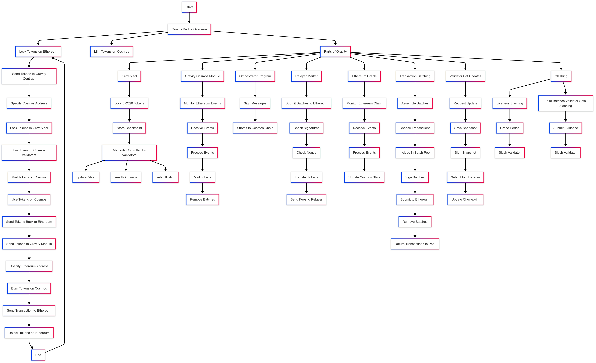

## 流程图的主要部分：
    
- Gravity Bridge Overview：概述 Gravity 桥的功能。

- Lock Tokens on Ethereum 和 Mint Tokens on Cosmos：描述从以太坊到 Cosmos 的代币转移过程

- Send Tokens Back to Ethereum：描述从 Cosmos 返回以太坊的代币转移过程。

## Gravity 的四个组成部分：

- Gravity.sol：负责锁定以太坊上的 ERC20 代币。

- Gravity Cosmos Module：负责在 Cosmos 上铸造代币。

- Orchestrator Program：运行在每个验证者上，用于处理签名和提交消息。

- Relayer Market：负责将交易提交到以太坊。

## 关键功能：

- updateValset：更新验证者集。

- sendToCosmos：将代币从以太坊发送到 Cosmos。

- submitBatch：将 Cosmos 上的交易批量提交到以太坊.

- Ethereum Oracle：监控以太坊链上的事件。

- Transaction Batching：将 Cosmos 到以太坊的交易批量处理。

- Validator Set Updates：更新 Gravity.sol 中的验证者集。

- Slashing：对行为不当的验证者进行惩罚。